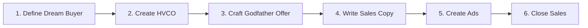

# 🚀 Sell Like Crazy Marketing Skill

> A Claude skill that applies Sabri Suby's *Sell Like Crazy* methodology to create high-converting marketing campaigns.

[](https://claude.ai)
[](https://github.com)
[](https://opensource.org/licenses/MIT)

---

## 📖 Overview

This skill enables Claude to help you build complete marketing systems that target the **97% of prospects** who aren't in "buy now" mode—while most businesses fight over the 3% ready to purchase.

### Core Philosophy

Build systems that:
- **Attract** attention with valuable content
- **Educate** prospects on their problems and solutions  
- **Nurture** relationships through the buying journey
- **Convert** prospects when they're ready to act

---

## ✨ Features

| Capability | Description |
|------------|-------------|
| 🎯 **Dream Buyer Personas** | Define your ideal customer using the Halo Strategy and Power 4% framework |
| 🧲 **Lead Magnets** | Create High-Value Content Offers (HVCOs) that attract qualified leads |
| 💎 **Irresistible Offers** | Craft Godfather Offers prospects can't refuse |
| ✍️ **Sales Copy** | Write converting copy using the proven 17-Step Selling System |
| 📢 **Ad Creation** | Build attention-grabbing Facebook & Google ads |
| 📞 **Sales Scripts** | Close deals consultatively with "Sell Like a Doctor" techniques |
| 📧 **Email Sequences** | Nurture leads through strategic email campaigns |

---

## 🗂️ Included Reference Files

```
references/
├── halo-strategy.md          # Dream buyer definition framework
├── hvco-guide.md             # High-Value Content Offer creation
├── godfather-offer.md        # Irresistible offer templates
├── 17-step-selling-system.md # Complete sales copy framework
├── ads-checklist.md          # Ad creation checklist
└── sales-techniques.md       # Consultative selling methods
```

---

## 🔄 The Workflow



### Step-by-Step

1. **Define Your Dream Buyer** — Identify your Power 4% using the Nine Questions framework
2. **Create an HVCO** — Build a lead magnet addressing their most pressing problem
3. **Craft Your Godfather Offer** — Include value building, risk reversal, scarcity, and social proof
4. **Write Converting Copy** — Apply the 17-step framework for pages and emails
5. **Create Attention-Grabbing Ads** — Use native-looking content that drives clicks
6. **Close Sales Consultatively** — Diagnose before prescribing; find their "bleeding neck" problem

---

## 💡 Key Principles

### The Job of Each Element

| Element | Its Job |
|---------|---------|
| Ad | Sell the click |
| Opt-in Page | Sell the opt-in |
| Landing Page | Sell the next step |
| Sales Mechanism | Make the sale |

### Attention Drivers

Use these psychological triggers to capture attention:
- Curiosity and intrigue
- Shock
- Direct or implied benefit
- Fear
- Vanity
- Self-interest *(better, richer, stronger, faster, healthier, happier, sexier, fitter, smarter)*

---

## 🚀 Usage

### Installation

Add this skill to your Claude environment by placing the skill folder in your skills directory:

```bash
cp -r sell-like-crazy /mnt/skills/user/
```

### Example Prompts

```
"Create a buyer persona for my SaaS product targeting small business owners"

"Write a lead magnet outline for a fitness coaching business"

"Help me craft a Godfather Offer for my consulting services"

"Write Facebook ad copy for my online course using the Sell Like Crazy framework"

"Create a 5-email nurture sequence for my real estate leads"
```

---

## 📚 Based On

This skill implements the methodology from:

**Sell Like Crazy** by Sabri Suby  
*How to Get As Many Clients, Customers and Sales As You Can Possibly Handle*

---

## 🤝 Contributing

Contributions are welcome! Please feel free to submit a Pull Request.

---

## 📄 License

This project is licensed under the MIT License - see the [LICENSE](LICENSE) file for details.

---

<p align="center">
  <i>Stop fighting over the 3%. Start winning the 97%.</i>
</p>
